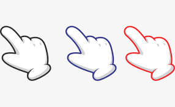

<h1>Cursor Movement  By Hand Gesture</h1>

<h2>members:</h2>
 
<ul>
<li>Utkarsh Tiwari(IIITU 17233)</li>
<li>Ritik Sharma(IIITU 18246)</li>
<li>Chandan Sitlani(IIITU 18140)</li>
<li>Yash Saxena(IIITU 18141)</li>
</ul>

This project uses our hand gesture to control a cursor on a screen,using computer vision. 
We use OpenCV(Python) to detect change in position of hand and correspondingly move the cursor. 

  <h2>Applications:</h2>
  <ul>
  <li>Can remove the use of mouse in computers</li>
